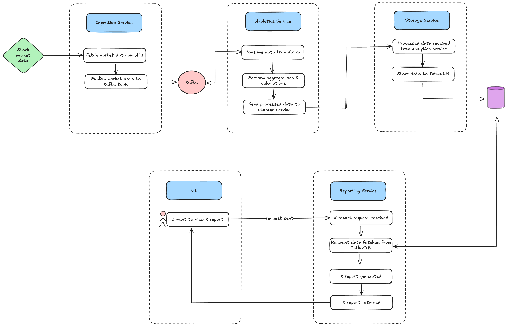

# finstream

### Solution Architecture:


### Spinning Up in Docker
1. Get your API key from: https://finnhub.io/
2. Build modules:
```bash
 mvn clean install && package
```
3. Spin up Docker:

```bash
 docker-compose -f docker-compose.yml up --build -d
```
